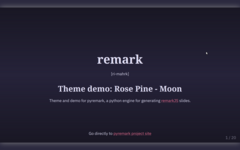

# pyremark_slides
**a python package for converting markdown to [remarkjs](https://github.com/gnab/remark) slides**.

a sister project of <a href="https://github.com/wcchin/pyreveal" target="_blank">pyreveal</a>. 

This project is done to put the markdown content to a base template file which is styled using jinja2, and also use the yaml header to do the config for each file. 

In other words, the purpose of this project focused on separating the heavy html/css configs from the markdown content, and keep only a minimal config setup using the yaml way on top of the markdown file. 

Please try.

## Install

    git clone https://github.com/wcchin/pyremark_slides.git
    cd pyremark_slides
    pip install -e .

## Using

    cd slides_dir
    pyremark -i a_file.md -w

a file name `a_file.slides.html` will be generated, open it with a browser.

## The markdown file template

    slide_title: testing remarkjs
    custom_css: custom.css
    remarkjs_path: remarkjs/remark-0.15.0.js
    
    # Some title
    
    ---
    
    second page

​    
## Available themes
### Demo
- Catppuccin: [Latte](testing/demo_0-Catppuccin_latte.slides.html) | [Mocha](testing/demo_1-Catppuccin_mocha.slides.html)
- Rose Pine: [Dawn](testing/demo_2-RosePine-dawn.slides.html) | [Moon](testing/demo_3-RosePine-moon.slides.html)
- Nord: [Polar](testing/demo_4-Nord-polar.slides.html) | [Storm](testing/demo_5-Nord-storm.slides.html)
- Evergreen: [Day](testing/demo_6-Everforest-day.slides.html) | [Night](testing/demo_7-Everforest-night.slides.html)

### Screenshot

| Theme      | Style              | Title page                                                   | Content page                                                 |
| ---------- | ------------------ | ------------------------------------------------------------ | ------------------------------------------------------------ |
| Catppuccin | Mocha  (dark) |  |  |
| Catppuccin | Latte  (light) |  |  |
| Rosepine | Moon (dark) |  |  |
| Rosepine | Dawn (light) |  |  |
| Everforest | Night (dark) |  |  |
| Everforest | Day (light) |  |  |
| Nord | Polar (dark) |  |  |
| Nord | Storm (light) |  |  | Nord | Storm (light) |  |  | 

## Added more themes (2025-03-26)
- make the Catppuccin theme to be generic, and added one dark theme based on Catppuccin
- added Rose Pine, Nord, and Everforest series themes
- added demo of the 4x2 themes.
- and fixed "the mathjax \_ not show properly issue"

## Update (2024-01-11)

- added catppuccin style, which use Montserrat as default font. 
- added gen_pdf.sh bash script in the testing folder, the to_generate_pdf.md is also updated to show the usage. [Decktape](https://github.com/astefanutti/decktape) is required. 

## Some additional feature (2023/2/13)

- press `s` to access the search function. 
- press `q` for the table of content.  

These features were in testing stage. 

Note:

- custom_css: this will be used to style the remark.js slides. 
- remarkjs_path: this is the local path for offline presentation, default to the online latest remark-latest.js file provided by the original repos. 
- slide_title: this is the title to be shown on the header of the presentation. 

custom.css file default to this:

    @import url(https://fonts.googleapis.com/css?family=Yanone+Kaffeesatz);
    @import url(https://fonts.googleapis.com/css?family=Droid+Serif:400,700,400italic);
    @import url(https://fonts.googleapis.com/css?family=Ubuntu+Mono:400,700,400italic);
    
    body { font-family: 'Droid Serif'; }
    h1, h2, h3 {
      font-family: 'Yanone Kaffeesatz';
      font-weight: normal;
    }
    .remark-code, .remark-inline-code { font-family: 'Ubuntu Mono'; }

